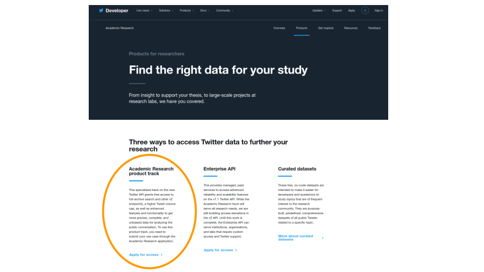
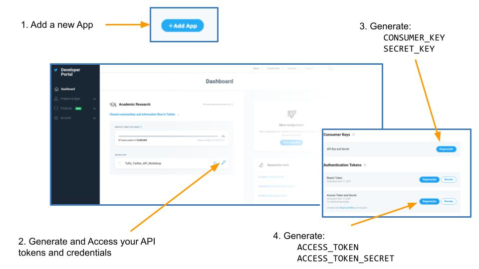

# The Twitter API

As Twitter has cemented itself as a critical component of public discourse it has also become a vital tool for researchers across a variety of disciplines. The Twitter API provides an avenue for these researchers to access the contents of the social media platform from up-to-date tweet content, historical tweet interaction timelines, and follower network relationships.  

In this 2-hour [Tufts DISC](https://disc.tufts.edu/) workshop we will learn some of the basics of API querying, we will have an opportunity to retrieve Twitter data using the Twitter API, we will do some exploratory analysis of Twitter data, and we will do this all in a data scientist approved Python environment. No prior knowledge of Python will be assumed. It is suggested that participants set up a Twitter developer account prior to the workshop, using the instructions below, but for those who are unable to do so, credentials for a group account will also be made available for the duration of the workshop.

## Workshop Materials

* [Slides](https://docs.google.com/presentation/d/1dBEx5eJ8mGcZONrVq_vRUbQNZjrsXSdL8hlUajHLLNM/edit?usp=sharing)
* [Google Colab Notebook](https://colab.research.google.com/drive/1NX2Bw5a22P2LVr5naClCGvojUCb6P6H0?usp=sharing)

## Setting Up Your Developer Account

Before you can access the Twitter API you'll need to have a Twitter developer account.  You can apply for access as an academic researcher at the [Twitter Developer Portal](https://developer.twitter.com/en/solutions/academic-research/products-for-researchers).  This process usually take several days.

Once you've been granted access, you can login to your [Developer Dashboard](https://developer.twitter.com/en/portal/dashboard) to retrieve your access tokens. 

Be sure to copy down your keys and tokens into a text file where you can find them later. 

## Accessing the API

Once we have developer credentials, there are several different tools that we can use to access the API.  Here are a few of them.

### Command Line API Access

* __Twurl__ is Twitter's version of curl, a library and tool for tranferring data using url syntax. This is the most "no frills" method for interacting witht the Twitter API and i's done directly from the command line. [_installation guide_](https://developer.twitter.com/en/docs/tutorials/using-twurl)
* __Twarc__ is part of the [Documening the Now](https://www.docnow.io/) project, which is a collaborative effort to move towards better and more ethical archiving and preservation practices for social media data.  You can access the Twitter API through the command line using twarc.  [_installation guide_](https://twarc-project.readthedocs.io/en/latest/) 

### Python API Access

* __Tweepy__ is a Python library for accessing the Twitter API.  You can easily access the Twitter API through Python scripts and Jupyter notebooks using Tweepy.  [_installation guide_](https://docs.tweepy.org/en/latest/install.html).  

